# Tomorrow's Newspaper

### The making of EON, a machine that reads annual reports, and an honest test of what it could see

**Author:** Gabriel George

**Technical white paper. Erebus Observatory Network (EON)**
30 September 2026 · Edition 4 · Illustrated revision

---

## Abstract

Over seventeen months I built five versions of the same idea: a machine that
reads company annual reports the way a patient analyst would, and writes down
what it thinks. It began in May 2025 as a folder of scripts studying thirty
years of great companies. It became EON: a system of downloaders, headless
browsers, key rotation, file locks, leases, heartbeats, a SQLite database, a
command line, a web interface and a Discord alarm, all built around one
constraint, a daily quota of model requests. Together the versions stored
29,375 answers from a language model, including 6,973 three-lens readings of
10-K filings, each ending in a single verdict.

This paper is mostly about how that machine was built and why it needed every
part. It is also about what the machine read, and whether it was right. Graded
naively, its BUY calls beat its SELL calls by 13 percentage points a year. But
the model had been trained on the years it was being graded on: it may have
read tomorrow's newspaper. Tested on filings after the stated training cutoff, the
rank spread shrinks; its SELL calls stop working; a score written down in advance
pointed the wrong way; and an options scan turned out to see how far a stock
would move, but not which way.

It was never going to rival Citadel, Point72 or the Medallion Fund. It was
worth building anyway, as a finance project, an AI project and a systems
project at once. The paper ends with a sealed bet: 1,257 verdicts frozen at
publication, to be graded in October 2027.

*Research, not investment advice.*

---

## Contents

1. [A reader for every annual report](#1-a-reader-for-every-annual-report)
- [Part I · Building the reader](#part-i-building-the-reader)
2. [The workshop: learning from great companies](#2-the-workshop-learning-from-great-companies)
3. [From scripts to a processor](#3-from-scripts-to-a-processor)
4. [Fintel: an application](#4-fintel-an-application)
5. [EON: one question, every filing](#5-eon-one-question-every-filing)
6. [Workflows as hypotheses](#6-workflows-as-hypotheses)
- [Part II · What it read](#part-ii-what-it-read)
7. [Every question it was asked](#7-every-question-it-was-asked)
8. [Was it right?](#8-was-it-right)
- [Part III · What it taught](#part-iii-what-it-taught)
9. [How the model went wrong](#9-how-the-model-went-wrong)
10. [Why it was worth doing](#10-why-it-was-worth-doing)
11. [The bet](#11-the-bet)
12. [Conclusion](#12-conclusion)
- [Appendix A: methods](#appendix-a-methods)
- [Appendix B: related work and references](#appendix-b-related-work-and-references)
- [Appendix C: reproduction](#appendix-c-reproduction)

---

## 1. A reader for every annual report

Every public company in the United States files a 10-K each year. It is the
fullest account a company gives of itself: what it sells, how it makes money,
what could go wrong, what it owes. The median 10-K in this project runs to 141
pages. Thousands are filed every spring. Professional analysts read the few
they are paid to cover; almost nobody reads the rest.

I wanted a reader that never tires. Give it any filing and it would read the
whole thing, ask the same careful questions every time, and write down what it
concluded, so that I could come back a year later and see whether it had been
right. A language model can now read 141 pages in a minute. The hard part is
everything around that minute.

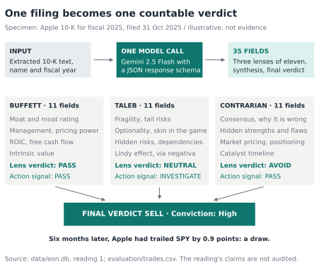

*Figure 1. One filing becomes one countable verdict. EON's first stored reading: Apple's 10-K for fiscal 2025, filed 31 October 2025. The model reads the filing as Warren Buffett, Nassim Taleb and a contrarian would, then gives one verdict. Six months later Apple had trailed the S&P 500 by 0.9 points: a draw. Sources: data/eon.db; evaluation/trades.csv.*

Figure 1 is what the finished machine produces. Its verdict on Apple reads:
"SELL. Conviction: High. Apple is an undeniably excellent company, but a high
conviction SELL rating is warranted given the significant disconnect between
its robust fundamentals and its highly stretched valuation." It is specific,
fluent and confident. Whether it is right is a separate question, and Part II
is about how hard that question turned out to be.

The paper has three parts. Part I tells how the machine was built, version by
version, and why each component exists. Part II describes everything it was
asked and tests its answers against what happened. Part III is about what the
project taught: where the model failed, and why the whole thing was worth
doing.

## Part I · Building the reader

{.illustration}

*Illustration — The workshop. A metaphor for the system in Figure 3: the machinery matters because the reader cannot run alone.*

EON was built five times. Each version answered a failure of the last and
kept what worked (Figure 2).

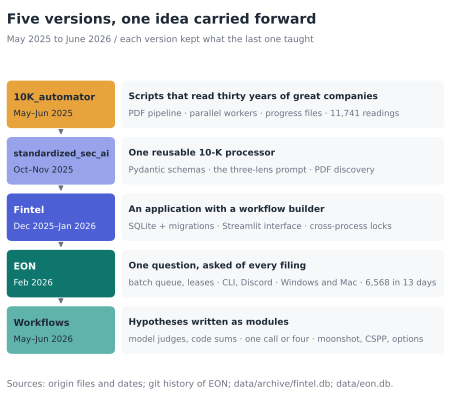

*Figure 2. Five versions, one idea carried forward. From scripts studying great companies to an application that reads every filing. Dates come from the origin project's files and the repository's git history. Sources: the origin project; git history; data/archive/fintel.db; data/eon.db.*

## 2. The workshop: learning from great companies

The project did not begin as a stock picker. It began, in May 2025, as a
question about excellence: what do great companies have in common, and which
other companies have it too?

The first answer was a folder of Python scripts called `10K_automator`. They
downloaded up to thirty years of annual reports for 39 long-run compounders
(Apple, Costco, Copart, Fair Isaac, O'Reilly, AutoZone and others), converted
each one to PDF with a headless Chrome browser, extracted the text, and asked
Gemini 2.5 Flash, then an April preview, to describe what made the company
work that year. A second pass distilled each company's thirty readings into
success factors; a third distilled all 39 into a meta-analysis.

It found six "universal" factors: operational excellence, capital allocation,
continuous innovation, domain expertise, culture, and customer focus. The
model credited continuous innovation to 100% of the companies. That should
have been a warning. A factor that every great company has, and that nearly
every annual report claims, cannot tell great companies from anyone else.

The scripts then read the recent filings of about 1,900 other companies and
scored each from 0 to 100 on its resemblance to the pattern. Between 3 and 13
May they produced 11,741 readings of individual filings, 4,641 of them on 13
May alone. Two more experiments followed: a contrarian scan on 26 May, scoring
1,933 companies on six dimensions of hidden strength, and an options scan on
4 June that proposed 951 trades in calls or puts, run on ten API keys with ten
progress files so that a crash would not lose the day.

Almost everything in EON started in those five weeks: reading whole filings
through a browser, parallel workers, progress files that survive a crash, and
the ambition to read the entire market. So did two problems. The outputs had
no fixed format; a script written later to flatten them found the six success
factors spelled about 130 different ways. And the model did not know what day
it was: of 1,919 comparative analyses run in May 2025, 1,916 dated themselves
2024.

The saved outputs survived. More than a year later, their recorded dates
made a different kind of test possible (Section 8.4), although local file
timestamps are not proof of an unchanged archive.

## 3. From scripts to a processor

In October 2025 the scripts became a single reusable module,
`standardized_sec_ai`. Its centre was `tenk_processor.py`, which downloaded,
converted and read filings for any ticker, and its most important change was a
single word: Pydantic.

Pydantic is a Python library for declaring the exact shape of data. Handed to
Gemini as a response schema, it forces the model to answer in named fields of
fixed types, and rejects any answer that does not fit. The project's own notes
from that month celebrate it: "No more JSON parsing errors!" The 130 spellings
of six factors could not happen again.

The same folder held `ppee.py`, the three-lens prompt from which EON's is
still drawn: read the filing as Buffett would (moat, management, price), as
Taleb would (fragility, tail risk, optionality), and as a contrarian would
(what everyone believes, and why they might be wrong).

## 4. Fintel: an application

In December 2025 the processor grew into an application called Fintel, with a
Streamlit web interface, a SQLite database and a visual workflow builder. A
user could chain steps (pick companies, fetch filings, run a lens, filter,
aggregate, export) and save the chain. The archive holds 16 of them: comparing
three chip makers, reading three nuclear start-ups, pulling executive pay from
a proxy statement.

The builder was good for discovering which questions mattered and bad for
measuring anything. No two chains asked the same thing, so nothing accumulated.
It was removed after three weeks.

What stayed was the infrastructure the builder had needed. Fintel was the
first version that ran several analyses at once, and running several analyses
at once broke things. Its first rate limiter used Python's `threading.Lock`,
which only works inside one process. When the command line and the web
interface ran together, or a batch spawned several processes, each had its own
lock and the calls collided: the API answered with errors 429 and 503. The fix,
recorded in a design note from January 2026, replaced it with a file lock
(`portalocker`) that every process on the machine could see. The same month
brought a nightly queue, an SEC rate limiter, and leases with heartbeats so
that a crashed worker could not strand a company forever.

## 5. EON: one question, every filing

In February 2026 the project was renamed EON, the Erebus Observatory Network,
and made one decisive change. Instead of many questions asked of a few
companies, it would ask one question of every company: the three-lens prompt,
with a 35-field schema, applied to every listed company's recent 10-Ks. Essays
became a panel, the same measurement taken across 1,358 companies and six
fiscal years. Everything in Part II depends on that.

Asking one question of every filing is easy to say. Figure 3 follows the
request from two front doors through a shared service to a stored answer.

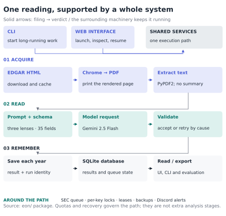

*Figure 3. One reading, supported by a whole system. The CLI and web interface use shared services. Arrows trace the filing through acquisition, model reading and durable storage. The SEC queue, key locks, leases, backups and alerts support execution around that path. This is a schematic of responsibilities, not a literal call graph. Source: the eon/ package.*

Each supporting component answers an operational constraint. The rest of this
section takes them in turn.

### 5.1 Getting the words: why a PDF, and not XML?

The SEC publishes every filing on EDGAR, free, as HTML. EON fetches them with
`sec-edgar-downloader` through its own queue, which keeps well inside the SEC's
fair-access limit of ten requests a second: two seconds between requests, at
most five at once, with a file lock so that parallel workers on one machine
share the budget. Each filing is cached by ticker and year and never fetched
twice; the cache now holds 27.5 GB of PDFs.

Why not simply read the HTML, or use the SEC's machine-readable XBRL data? The
measurements answer both (Figure 4).

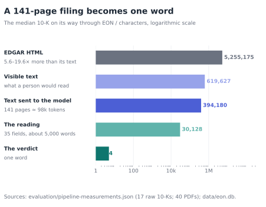

*Figure 4. A 141-page filing becomes one word. Characters at each stage for the median 10-K: raw EDGAR HTML across 17 sampled filings, their visible text, the text EON extracts from its PDF (40 sampled filings), the stored reading, and the verdict. Sources: evaluation/pipeline-measurements.json; data/eon.db.*

Raw EDGAR HTML is 5.6 to 19.6 times larger than the text a person would read.
Most of the difference is markup, and much of that is inline XBRL: between
1,170 and 3,888 machine-readable tags per 10-K, plus a hidden header of tagged
data. In Kraft Heinz's 2022 10-K, the invisible XBRL header (645,000
characters) is larger than the entire visible report (642,000). Feed that HTML
to a model and most of what you pay for is markup; strip the tags naively and
the hidden data pours into the text.

XBRL itself is excellent for numbers: revenue, debt, cash flow, tagged and
comparable. But EON's questions are about judgement: moats, fragility, what
management says about risk. That lives in the narrative, which XBRL does not
structure.

So EON prints each filing the way a person would see it. A headless Chrome
browser opens the HTML, waits between 3 and 15 seconds depending on the file's
size so that the page finishes rendering, and calls Chrome's own print-to-PDF
command. The result is exactly what a reader sees: tables laid out, hidden
XBRL gone, 141 pages at the median. PyPDF2 then extracts the text in about 6
seconds. Nothing is summarised or cut; a filing too long for the model's
context is skipped, not truncated.

The route costs a browser per filing, and browsers misbehave. A conversion that
hangs is abandoned after 180 seconds and the browser restarted. Orphaned Chrome
processes accumulate over a long batch, so EON sweeps them up every 50
companies, or sooner if memory use passes 80%. Tables and layout can still be
mangled in extraction; that path has not been audited, and parsing HTML
directly would be cleaner. For a machine built to read like a person, printing
the page like a person was the simplest reliable answer.

### 5.2 Asking the question

The median filing arrives as about 394,000 characters, roughly 100,000 tokens.
EON appends all of it to the three-lens prompt and sends one request to Gemini
2.5 Flash, with the 35-field schema attached. The model returns about 30,000
characters, 5,000 words of analysis, and one verdict (Figure 4).

Pydantic validates every response before it is stored. A response that does
not fit is not a reading. Failures are sorted by cause before they are
retried: a rate limit waits for exactly as long as the API's own retry-after
field says; a transient server error backs off and tries again; a context
overflow is marked skipped and never retried. Across all 6,973 three-lens
readings, the model's input came to roughly 0.7 billion tokens.

### 5.3 Twenty requests a day

The binding constraint was not compute, storage or money. It was requests. The
February configuration rotated 25 API keys, each allowed 20 requests a day,
with a mandatory 65-second pause between requests on any one key. That is 500
filings a day, at most.

Every other design decision in EON follows from that number, and getting it
right took three attempts.

The first, in Fintel, was the in-process lock that different processes could
not see. The second was the file lock that fixed it: one lock for the whole
machine, held through each request and its 65-second pause. It worked, and it
made 25 keys exactly as slow as one. The third, in EON, gave every key its own
lock file and added a 25-slot semaphore within each process. Requests on different
keys could overlap; each key's file lock coordinated its use across
processes on the same machine.
The pause adapts: it shrinks after a run of successes, down to about 21
seconds, and grows by half after a rate-limit error.

A fourth bug was quieter. On 6 February 2026 a commit titled "Remove
double-counting of API key usage that halved effective capacity" found that
every request was recorded twice, once by the model provider and again by
seven of its callers, so each key reached its limit of 20 after 10 real
requests. For a while the machine had been running at half speed and reporting
itself full.

Parallelism is what turned 25 keys into 500 readings a day. Figure 5 shows the
difference between the two ways the command line runs.

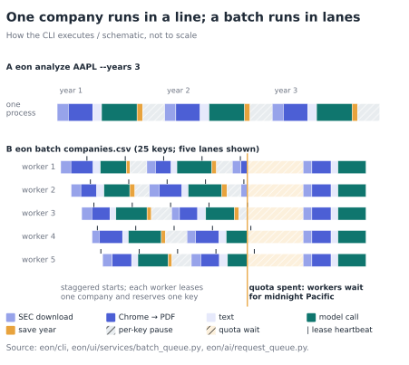

*Figure 5. One company runs in a line; a batch runs in lanes. A single analysis downloads, prints, extracts, asks and saves one fiscal year after another. A batch starts up to 25 workers with staggered starts; each leases one company, reserves one key, and renews its lease with a heartbeat. When every key is spent, all workers wait for the reset at midnight Pacific. Schematic. Sources: eon/cli; eon/ui/services/batch_queue.py; eon/ai/request_queue.py.*

The market-wide batch ran from 8 to 21 February 2026 and read 6,568 filings
from 1,327 companies (Figure 6). At its busiest it finished 189 readings in an
hour, one every 19 seconds across all workers. But it was active for only 62
of the thirteen days' hours. For about 80% of its life, the fastest part of
the machine was waiting for midnight.

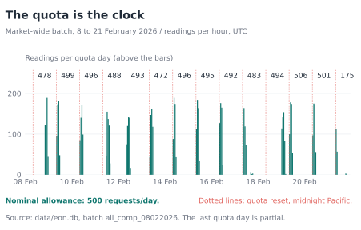

*Figure 6. The quota is the clock. Readings per hour during the February batch, with approximate quota-day totals of 472 to 506 above the bars. The reset boundary is reconstructed, so a day can slightly exceed 500. Source: data/eon.db, frozen in figure-data/evidence.json.*

Of the 1,410 companies attempted, 83 failed: 61 because no filing could be
retrieved, and 22 after the model call failed repeatedly.

### 5.4 The database is the batch's memory

A batch that runs for two weeks will be interrupted: by a crash, a reboot, a
power cut, a closed laptop. The database is what lets it pick up where it
left off, preserving completed years and reducing repeated work (Figure 7).

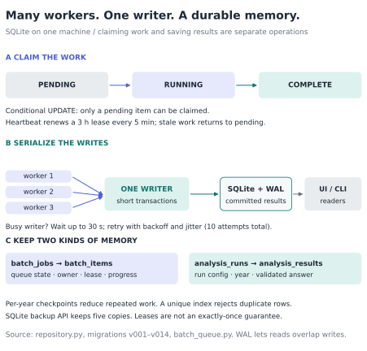

*Figure 7. Many workers, one writer. A conditional update claims a pending company; heartbeats maintain its lease. SQLite serializes short write transactions while WAL allows readers to overlap the writer. Batch tables remember progress; analysis tables preserve readings. Checkpoints and uniqueness constraints reduce repeated work but do not promise exactly-once model calls. Sources: eon/ui/database/repository.py and migrations; eon/ui/services/batch_queue.py.*

EON uses SQLite, a single file, because the whole system runs on one machine
and a server database would add a service to install, configure and keep
alive. SQLite's weakness is that only one writer can write at a time. EON
works with that rather than against it.

- **Write-ahead logging.** WAL mode allows readers to overlap the writer, so the
  web interface can browse results while a batch writes new ones.
- **Patience, then retries.** Each connection waits up to 30 seconds for the
  lock, with up to ten attempts in total and exponential backoff plus random
  jitter, so that competing workers do not retry in lockstep.
- **Leases.** A worker claims a company with a conditional update (set it to
  running, but only if it is still pending), so exactly one worker wins. The
  claim carries a lease of three hours, renewed by a heartbeat every five
  minutes. If a worker dies, its heartbeat stops, its lease expires, and the
  company returns to the queue.
- **Crash recovery.** On start-up EON checks whether the process that last
  held the batch is still alive. If not, its companies go back to pending.
- **Per-year checkpoints.** Each fiscal year's reading is saved the moment it
  arrives. An interrupted company resumes from its last completed year, not
  from the beginning.
- **A unique index.** In February a double-save pattern (once as each year
  finished, once at the end) quietly stored some readings twice; `INSERT OR
  IGNORE` had nothing to ignore against. Migration 14 removed the duplicates
  and added a unique index. (Separate batches that overlapped still read some
  company-years twice, which is why 6,973 stored rows hold 6,653 distinct
  company-years; the evaluation keeps the first.)
- **Backups.** During a batch, EON copies the database with SQLite's own
  backup API and keeps the last five.

The schema itself has been through 14 migrations, each written to be safe to
run twice and applied automatically at start-up. One earlier file in the
repository's history is named `fintel.db.corrupted`: a reminder of why the
rest exists.

### 5.5 Two front doors and a doorbell

EON has a command line and a web interface, and they do different jobs.

The command line is for long work. A batch of a thousand companies over ten
years needs twenty days of quota; the README's advice is to start it in a
terminal multiplexer and detach, because a batch must outlive any browser tab.
`eon batch`, `eon analyze`, `eon export` and `eon scan-contrarian` are built
with Click.

The Streamlit web interface is for looking: launching a single analysis,
browsing history, reading results, managing the batch queue, and resuming
anything interrupted. For a while the two had their own code paths and drifted
apart. On 6 February both were rebuilt on one shared service layer, so a batch
started from either behaves the same way, and a batch started from the command
line can be watched from the browser.

The doorbell is Discord. A batch that runs overnight for two weeks needs a way
to say something while its owner is asleep or away. EON posts to a Discord
webhook when a batch completes or fails, when every key is spent and it is
waiting for the reset, and when disk space runs low: the 27.5 GB of PDFs are a
real risk. Before starting, it checks that there is room.

### 5.6 Two machines

EON ran on two computers. The February batch ran on Windows; the database
still stores its paths with backslashes. Development happened on a Mac, which
kept its own database of 1,184 readings. A pull request titled "multi-os
support", merged on 2 February 2026, made the difference invisible. File locks
use `portalocker`, which speaks both Windows and Unix locking. Paths are built
with the platform's own separators. Stray Chrome processes are cleaned up with
`pkill` on the Mac and `taskkill` on Windows.

### 5.7 Is it efficient?

It depends on what is scarce.

Against the quota, EON aims to make every request count: each reads a whole
filing, and checkpoints reduce repeated calls after an interruption. Against the clock, it is not:
the batch spent about 80% of its time waiting. Against compute, it is
wasteful but cheap: a browser per filing and about 6 seconds of extraction
buy a readable text whose fidelity still needs an audit. Against storage, it is heavy: 27.5 GB of PDFs for a
database of 240 MB.

If requests were plentiful, the design would change. Parsing HTML directly
would drop the browser. Caching extracted text instead of PDFs would cut the
disk. Sending only the sections each lens needs would cut tokens
substantially. Section selection trades coverage for speed; direct HTML parsing and text
caching could improve efficiency without that trade, provided their output
was checked. The quota made those optimisations less urgent.

## 6. Workflows as hypotheses

With the panel built, the questions became narrower. From May 2026 new
analyses were written as custom workflows: Python files, discovered
automatically, each with its own prompt and schema. They became a way to write
down a hypothesis and test it on hundreds of filings.

**CSPP** turned a long analytical framework (17 scored components in 5
domains) into a reading. Its first version asked for everything in one call,
with a schema of about 106 KB, 28 times the size of one lens. When any of its
roughly 200 required fields drifted, validation failed and the whole reading
was lost. On 20 May 2026 it was split into four smaller calls, merged in code,
with a partial result kept if one part fails. The rewrite also stopped
trusting the model's arithmetic: it supplies component scores, and Python adds
them up.

**Moonshot × Excellence** asked whether a company offers an asymmetric bet and
whether it resembles the great companies of 2025. It uses one call on purpose:
it can include up to 250,000 tokens of reference material, and a second call
would resend all of it and spend another request. It rates six dimensions on
anchored 0–10 scales and computes the totals in code. It also carries a
watchdog, added after a large filing hung a call for about two hours without
an error.

**Contrarian Hunter** and the **options scans** brought the 2025 experiments
into EON. The February 2026 options scan, Asymmetric Options V4, read the
latest filing of 1,415 companies in two days and assigned each a directional
bias. Section 8.5 tests it.

Two rules came out of this work. Split a question the model cannot answer
reliably in one piece. And let the model judge while code does the counting.

## Part II · What it read

{.illustration}

*Illustration — Three records, different clocks. The illustration introduces the question; Figure 9 specifies the event order that each test requires.*

## 7. Every question it was asked

Across five versions, the model gave 29,375 stored answers (Figure 8).

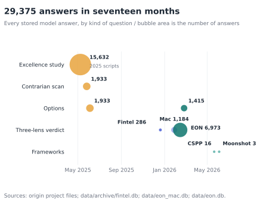

*Figure 8. 29,375 answers in seventeen months. Every stored model answer, grouped by the question it answered. Bubble area is the number of answers. Sources: the origin project's files; data/archive/fintel.db; data/eon_mac.db; data/eon.db.*

| Analysis | When | Answers | Asked |
|---|---|---:|---|
| Excellence study | May 2025 | 15,632 | What made great companies great, and who resembles them? |
| Contrarian scan | May 2025 | 1,933 | Where is strength hidden that others miss? |
| Options ideas | June 2025 | 1,933 | Buy calls, buy puts, or neither? |
| Fintel analyses | Dec 2025–Jan 2026 | 286 | Fundamentals, single lenses, syntheses |
| Three-lens verdicts | Jan–Jul 2026 | 8,157 | Buy, hold or sell, as Buffett, Taleb and a contrarian |
| Asymmetric Options V4 | Feb 2026 | 1,415 | Which way is the tail risk? |
| CSPP and Moonshot | May–Jun 2026 | 19 | Frameworks too large for one call |

Read together, the answers show a model with habits.

- **It likes to hold.** Of 6,411 dated three-lens verdicts, 50.8% say HOLD,
  27.5% BUY, 16.5% SELL, 3.8% STRONG BUY and 1.4% STRONG SELL. The mix barely
  moves from year to year, through a boom, a bear market and a recovery.
  Conviction is Medium 4,632 times, High 1,516 times and Low only 148 times.
- **It finds danger everywhere when asked to look for it.** Asked where the
  tail risk lies, the February 2026 options scan gave 873 companies (62%) a
  put bias and 27 (2%) a call bias.
- **It favours the famous.** The 2025 contrarian scan, meant to find hidden
  gems, put MicroStrategy first, followed by Apple, AST SpaceMobile, Tesla,
  Microsoft and Nvidia. Only 27 of 1,933 companies scored 70 or more.
- **Its numbers cluster.** A quarter of all 2025 compounder scores are exactly
  68, and three values cover 44% of companies.

None of this says whether the answers were right. That takes a test, and the
test is harder than it looks.

## 8. Was it right?

### 8.1 Three dates

In February 2026, while the market-wide batch was still running, I checked
the readings against stock returns. BUY-rated filings had beaten SELL-rated
ones by 14.1 percentage points over two years. The report concluded that the
model had genuine stock-picking skill.

It had skipped a question. The model was being graded on years it had already
read about. Gemini 2.5 Flash's training data ends in January 2025, according to
Google, and this paper uses 31 January 2025 as the line. Show it a 2021 annual
report and ask whether to buy: the report ends in 2021, but the model knows how
2022 went. A backtest like that is a trader handed tomorrow's newspaper. Their
record would be extraordinary, and it would say nothing about their judgement.

Every verdict therefore has three dates: when the company filed, where the
model's knowledge ends, and when the verdict was written. Their order decides
what a test can prove (Figure 9).

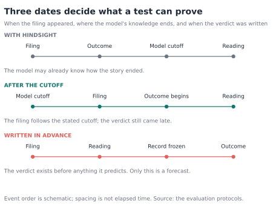

*Figure 9. Three dates decide what a test can prove. Only the third arrangement, a verdict recorded before anything it predicts, is a forecast in the ordinary sense. Event order is schematic. Source: the evaluation protocols.*

Every test below uses one reading per company and year; entry at the first
close after the filing (or, for the ledgers, after the reading); returns in
excess of SPY, the S&P 500 fund; and significance from shuffling verdicts
10,000 times within each year, and within each year and industry. Appendix A
has the details.

### 8.2 With hindsight, and after the cutoff

For one-year windows that closed before the cutoff, 1,099 BUY readings beat
SPY by 2.2 points and 657 SELL readings trailed it by 10.9: a spread of 13.1
percentage points (p = 0.0001). About 42% of it came from favouring the right
industries.

For the 1,443 filings published after the stated cutoff, the same test gives a different picture (Figure 10). Ranked by where each
stock finished within its year, the spread halves, from 11.1 to 6.2 percentile
points. The average spread, 14.9 points, looks unchanged, but its uncertainty
is ±23 points.

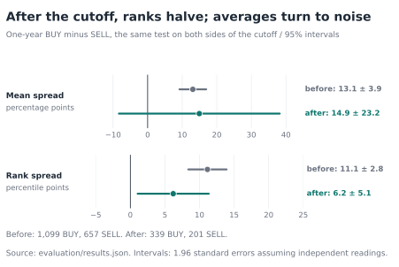

*Figure 10. After the cutoff, ranks halve; averages turn to noise. The same one-year BUY-minus-SELL comparison on both sides of the model's knowledge cutoff, with 95% intervals from independent-reading standard errors. The permutation tests in the text are the formal results. Source: evaluation/results.json.*

Where the edge lived also changed (Figure 11). Before the cutoff, the five
verdicts formed a perfect staircase: STRONG SELL companies finished at the
43rd percentile of their year, SELL at the 43rd, HOLD at the 50th, BUY at the
54th, STRONG BUY at the 60th. After it, BUY still finished above the middle,
but SELL rose to the 49th percentile, level with HOLD. The SELL calls, which
had carried most of the historical spread, stopped working.

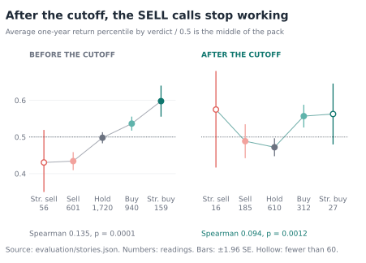

*Figure 11. After the cutoff, the SELL calls stop working. Average within-year percentile of one-year excess return by verdict, ±1.96 standard errors; hollow points have fewer than 60 readings. The verdict order still correlates with outcomes after the cutoff (Spearman 0.094, p = 0.0012), driven by BUY rather than SELL. Descriptive. Source: evaluation/stories.json.*

A model that remembered which companies collapsed would look like this. So
would a model whose caution suited 2021 to 2024 and not 2025. The data cannot
choose between them.

The post-cutoff sample retains a small rank association. By rank, BUY readings beat SELL
readings by **5.9 percentile points (p = 0.0059)** within industries. That
statistic was chosen after the next figure was seen, and it rests largely on
one filing season. By average, the result is inconclusive: 4.6 points at six
months (p = 0.094) and 14.9 at a year (p = 0.215).

### 8.3 One stock, and twenty-four

The average fails because of one company (Figure 12). Babcock & Wilcox filed
its 10-K on 31 March 2025, closed at $0.46 the next day, and stood at $15.72 a
year later: 3,314 points ahead of SPY. That single reading adds 10 points to
the BUY group's average. The price series was checked against Nasdaq's
independent record; there was no split. EON read the filing on 9 February
2026, rated it BUY, and by then the stock had already risen about twentyfold.
The documented cutoff precedes that rise, and the call path has web search
switched off. Those facts reduce one route to hindsight; they do not turn
a late reading into a forecast.

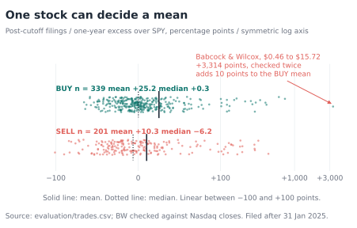

*Figure 12. One stock can decide a mean. Every post-cutoff BUY and SELL reading with a one-year outcome. Solid lines are means, dotted lines medians; the axis is linear to ±100 points and logarithmic beyond. Sources: evaluation/trades.csv; evaluation/verification/bw-price-check.json.*

Averages also hide what the verdicts look like one company at a time. Figure
13 shows 24 companies drawn at random, with a published seed, from the 195 that
EON read in every year from 2020 to 2024 and rated both BUY and SELL at least
once. Of their 70 BUY and SELL calls, 40 went the right way: 57%. Read row by
row, the grid looks less like foresight than a slightly loaded coin.

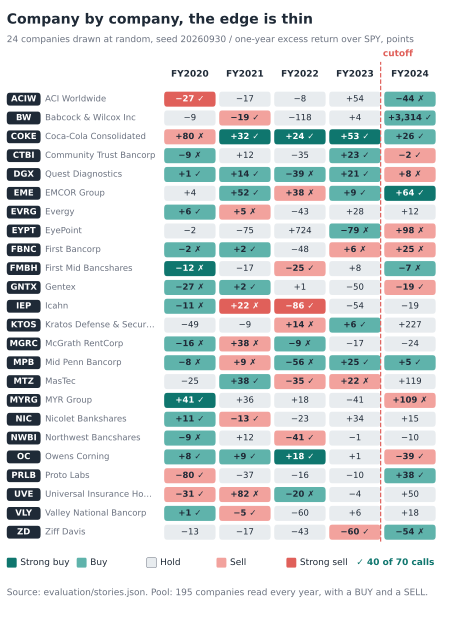

*Figure 13. Company by company, the edge is thin. Colour is the verdict; the number is the one-year return over SPY in percentage points; a tick marks a BUY that beat SPY or a SELL that trailed it. The rule selects on verdicts, never outcomes. Because the median stock trailed SPY in these years, SELL ticks come cheaply. Source: evaluation/stories.json.*

### 8.4 A ledger written in 2025

The strictest evidence is the oldest. The 2025 scripts wrote their scores to
disk in May and June 2025, after the model's cutoff and before any of the
returns they might predict. They are a ledger, and they need no argument about
training data (Figure 14). Their dates come from file timestamps, not a sealed
archive, and I had looked at the first result before writing the test.

**Resemblance to great companies pointed the wrong way.** Across 1,766
companies, the higher the 2025 compounder score, the worse the next year:
Spearman −0.14, p = 0.0001. The top fifth trailed SPY by 17.8 points on
average; the bottom fifth beat it by 18.6. A sensible idea, carefully applied,
failed its first year. One plausible reason, untested, is that looking like a
past winner was already in the price. The original ambition was about decades,
which one year cannot settle.

**The contrarian score and the options calls showed nothing.** Spearman +0.01
(p = 0.71) for the contrarian score; calls minus puts +2.8 percentile points
(p = 0.54) over six months for the options ideas.

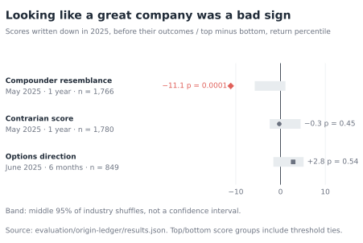

*Figure 14. Looking like a great company was a bad sign. Top fifth minus bottom fifth of each 2025 score (calls minus puts for options), in percentile points of return, against the middle 95% of 10,000 industry-preserving shuffles. Source: evaluation/origin-ledger/results.json.*

These are not EON's verdicts. Across 1,054 companies scored by both, the
compounder score and EON's verdict are almost unrelated (Spearman 0.05).

### 8.5 A ledger written in February 2026

EON left a ledger of its own. The Asymmetric Options V4 scan of 25–26 February
2026 recorded, for 1,415 companies, a directional bias and an asymmetry score,
six months before the outcomes it would be graded on. I wrote the test before
running it (Figure 15).

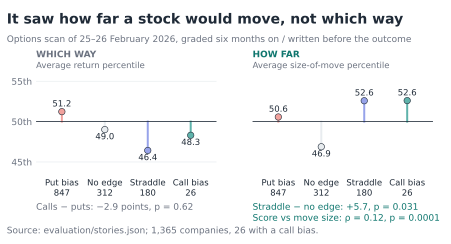

*Figure 15. It saw how far a stock would move, not which way. Six-month outcomes for 1,365 companies, by the bias the scan recorded in February 2026. Left: direction, as the average percentile of excess return. Right: magnitude, as the average percentile of the absolute excess return. Source: evaluation/stories.json.*

On direction, the scan had no skill. Stocks marked for calls did no better
than stocks marked for puts (−2.9 percentile points, p = 0.62); put-bias
stocks in fact beat SPY slightly more often than the rest. On magnitude, it
did. Its asymmetry score correlated with the size of the move, up or down
(Spearman 0.12, p = 0.0001), and stocks marked "straddle", the model's way of
saying something big will happen, moved more than those marked "no edge"
(p = 0.031).

The useful distinction is magnitude versus direction: the recorder and
unsettled compass in the illustration. Perhaps filings expose fragile balance
sheets or binary risks; that explanation was not tested. The association
concerns absolute excess returns, not realised volatility, and establishes
neither profitable options trades nor an advantage over options prices.

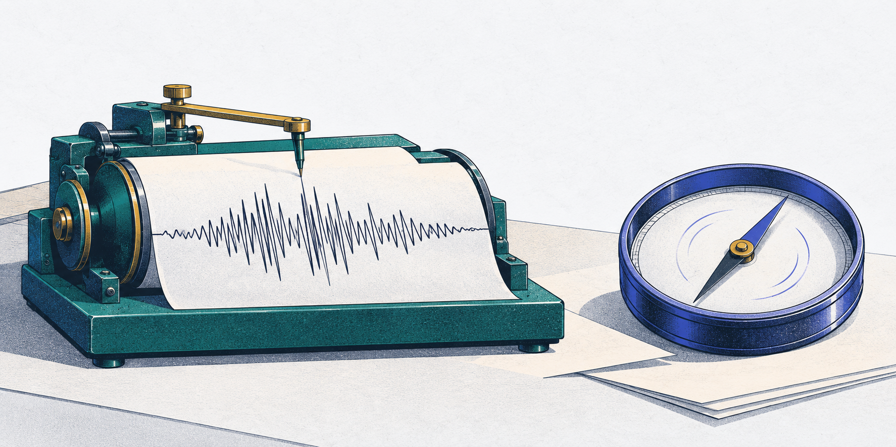{.illustration width=42%}

*Illustration — How far, not which way. Read alongside the measured outcomes in Figure 15.*

### 8.6 What the tests say together

Graded with hindsight, the model looked like an analyst. Tested on later filings and dated readings, it looked like a careful reader
with a small rank association, one bad idea and one modest talent. The evidence has limits that apply
throughout: the later tests cover roughly the same eighteen months;
the universe was drawn from companies still listed in 2026; industry is
controlled but size, value, quality and momentum are not; extraction and the
model's facts are unaudited; and returns are not trades. Section 11 is what
the paper does about that.

## Part III · What it taught

{.illustration}

*Illustration — The confident narrator. Stale dates, repeated answers and selective attention can hide behind fluent prose; Figure 16 records the observed patterns.*

## 9. How the model went wrong

The most useful findings in this project are not about stocks. They are about
how a fluent language model fails when it is asked to do a job thousands of
times (Figure 16).

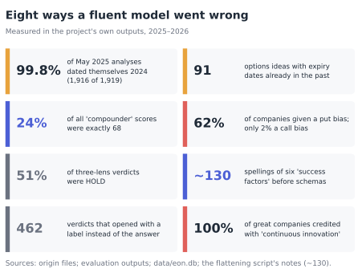

*Figure 16. Eight ways a fluent model went wrong. Each number is measured in the project's own stored outputs. Sources: the origin files; evaluation outputs; data/eon.db; the flattening script's notes.*

**It did not know what day it was.** Run in May 2025, the model dated 1,916 of
1,919 analyses 2024, a year behind, and proposed 91 option expiries that had
already passed. It reasons from its training-time present unless told
otherwise. EON's later workflows stamp dates in code.

**It may remember the future.** A model trained after the events it is asked
to judge can borrow from them without saying so. A search of every reading
for terms with known first-use dates found no careless leaks: the Inflation
Reduction Act appears in 300 readings, never in one of a filing written before
the law. But a verdict nudged by memory leaves no trace in its prose.

**Its numbers are less precise than they look.** A quarter of all compounder
scores were exactly 68. A 0–100 scale that behaves like a four-point one
invites false precision. The later workflows use anchored scales, each defined
at 0, 5 and 10.

**It leans.** It holds half the time. Asked to look for tail risk, it found it
in 62% of companies and upside in 2%. The framing of a question shapes the
answer's direction as much as the evidence does.

**It favours platitudes and the famous.** It credited "continuous innovation"
to every great company, and its contrarian scan's hidden gems included Apple,
Microsoft and Nvidia.

**It drifts in format.** Without a schema, six factors took 130 spellings.
With one, 462 verdicts still opened with a label ("Overall investment
recommendation: …") instead of the answer, and conviction arrived in half a
dozen phrasings. Every parser
must expect this.

**It cannot always add.** CSPP stopped trusting its arithmetic and recomputed
every total in code.

**It sometimes stops.** One large filing hung a call for about two hours
without an error. Every call now has a watchdog.

**It values without prices.** Apple's SELL rests on a "highly stretched
valuation", but a 10-K contains no current share price. The model supplies one
from memory, which is exactly the channel through which hindsight can leak.

## 10. Why it was worth doing

EON was never going to rival Citadel, Point72 or the Medallion Fund. Those
firms buy data nobody else has, trade in milliseconds, employ hundreds of
researchers, and move capital at scale. Medallion is famous for short-horizon
statistical patterns, not opinions about annual reports. A 10-K is the most
public document a company produces. Thousands of professionals read the
important ones on the day they are filed; whatever it says is in the price
within hours. A machine reading the same text a year later, on free quotas,
was not going to find money lying on the pavement.

It was worth doing anyway, because it was three projects at once.

**As a finance project,** it turned a vague question (can reading annual
reports well tell you anything?) into a measurable one, and taught the
details that make such measurements honest: excess returns and their
benchmark, industry composition, survivorship, the difference between an
average and a rank, one stock deciding a mean, and above all look-ahead. The
answer was humbling in the right way: what a filing says is largely known, and
what it signals most reliably is risk, not direction.

**As an AI project,** it measured a language model at scale, on the same task,
thousands of times, and caught it misdating its work, drifting in format,
clustering its scores, leaning bearish when asked about risk, and possibly
remembering the future. Those are not failures of a particular prompt. They
are properties of fluent models, and they only show up in volume.

**As a systems project,** it forced real engineering under a hard constraint:
cross-process locks, key rotation, leases and heartbeats, crash recovery, a
database built to survive two weeks of interruption, two operating systems,
two interfaces, and an alarm that works while you sleep. None of that was
planned. Every piece answers a failure that happened.

And it left something no one else has: 29,375 answers written down with their
dates, a method for testing them honestly, and a bet.

## 11. The bet

Every lesson in this paper points to one practice: write the verdict down, with
its date, before the future arrives. So the paper makes a forecast of its own
(Figure 17).

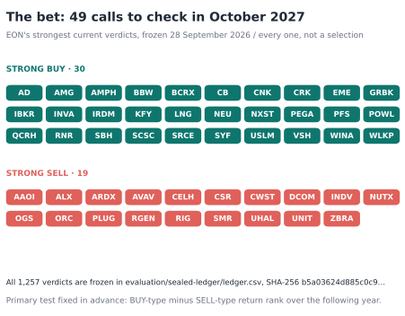

*Figure 17. The bet: 49 calls to check in October 2027. EON's latest verdict on each of 1,257 companies, frozen on 28 September 2026 with their prices, and graded one year after publication. The tiles are every STRONG BUY and STRONG SELL, not a selection. Source: evaluation/sealed-ledger/.*

The ledger holds EON's most recent verdict for each of 1,257 companies: 634
HOLD, 341 BUY, 233 SELL, 30 STRONG BUY and 19 STRONG SELL. The whole file is
fixed by its SHA-256 fingerprint, which begins b5a03624d885c0c9. The test was chosen in
advance: BUY-type minus SELL-type percentile rank of one-year return over SPY,
from the first close after 30 September 2026. Many of these verdicts are
already a year old, since they read filings from early 2025; that is part of
the test.

The next vintage should do better than a frozen file on one laptop. Read the
fiscal 2025 reports now, with the same model and prompt; store each reading
with the filing's identifier, a hash of the text the model saw, the prompt
version and the time; pin the model, because a new model has a new cutoff and
turns clean evidence back into hindsight; tell it the date; and publish the
fingerprint somewhere public before the returns arrive.

## 12. Conclusion

I set out to build a patient reader. It took five versions and seventeen
months, and most of the work was not reading at all. It was waiting for
midnight, printing web pages, keeping two dozen workers from colliding, and
making sure nothing was lost when something broke.

The reader works. It is specific, tireless and consistent enough to be counted.
Counting it produced a result that looked like foresight, and arranging the
evidence by what the model could have known took most of that away. What
remains is worth testing again: a small rank association in BUY calls, an
association with the size of later moves, and a clear view of how a fluent
model goes wrong.

The model's documented newspaper ends in January 2025. A forecast earns its
name only when it is recorded before the events it predicts.

{.illustration width=86%}

*Illustration — Open October 2027. Ledger fingerprint: `b5a03624`. This seal is a metaphor; the hash identifies the file, while independent timestamped publication would establish when it was fixed.*

**Write the question once. Keep the answer with its date. Let the next year
answer back.**

---

## Appendix A: methods

**Scope.** One reading per ticker and fiscal year, the first stored. Of 6,653
such readings, 6,651 were made with Gemini 2.5 Flash; two made with Gemini 3.5
Flash are excluded. A usable observation needs a parsed verdict, a filing date
and prices: 6,203 readings of 1,309 companies.

**Returns.** Entry at the first close strictly after the filing date. Excess
return is the change in adjusted close over 126, 252 or 504 trading sessions
minus SPY's change over the same dates, in percentage points, not annualised.
For the ledgers, entry follows the recorded reading date. Prices are a frozen
Yahoo Finance snapshot through 28 September 2026; the largest outlier was
checked against Nasdaq.

**Samples.** "Before the cutoff" means the return window closed before
31 January 2025. "After the cutoff" means the filing was published after it.
That is a boundary reported by the provider, not an independent audit of the
model's knowledge. Some readings were made after entry or after part of the
return window; these are retrospective post-cutoff tests, not forecasts.

**Spreads and ranks.** The mean spread is the BUY-group average excess return
minus the SELL-group average. The rank spread uses each reading's percentile
within its fiscal year, so no single stock can dominate.

**Permutation tests.** Verdicts are shuffled 10,000 times within fiscal years,
and separately within fiscal-year-and-industry groups (industry from a
February 2026 FactSet snapshot; single-reading groups dropped). Two-sided
p-values measure distance from the shuffled mean, with a plus-one correction;
0.0001 is the floor.

**What was fixed in advance.** The historical one-year and post-cutoff
six-month tests were specified first. The post-cutoff one-year test, the rank
statistic and the anachronism search were added after earlier results were
seen. The verdict ladder, company grid and February 2026 options test follow
`stories-config.yaml`, written before they were run. None is adjusted for
multiple comparisons.

**Ledgers.** The 2025 scores are read from the origin project without
modification; compounder dates come from file modification times, other dates
from filenames. The February 2026 options scan uses each reading's stored
timestamp.

**Pipeline measurements.** Page counts, characters and extraction times come
from 40 randomly sampled cached 10-K PDFs; markup ratios and XBRL counts from
17 raw EDGAR 10-K files. Tokens are estimated at four characters each.

## Appendix B: related work and references

Sarkar and Vafa show that pretrained language models carry information about
periods after their nominal analysis date, and test for it with events that
should be unpredictable; the anachronism search in Section 9 is a simple
instance. Glasserman and Lin measure look-ahead bias in model-scored news
sentiment and reduce it by removing company names. Lopez-Lira and Tang find
that model readings of headlines predict next-day returns; EON reads a
different document over a longer horizon, and its results are not a
replication.

- Glasserman, P. and Lin, C. (2023). *Assessing Look-Ahead Bias in Stock
  Return Predictions Generated by GPT Sentiment Analysis.* arXiv:2309.17322.
- Google. *Gemini 2.5 Flash model documentation*, knowledge cutoff January
  2025. ai.google.dev/gemini-api/docs/models/gemini-2.5-flash.
- Lopez-Lira, A. and Tang, Y. (2023). *Can ChatGPT Forecast Stock Price
  Movements? Return Predictability and Large Language Models.*
  arXiv:2304.07619.
- Sarkar, S. K. and Vafa, K. (2024). *Lookahead Bias in Pretrained Language
  Models.* SSRN 4754678.
- US Securities and Exchange Commission. *EDGAR fair access policy*: no more
  than ten requests per second.

## Appendix C: reproduction

The Markdown is the editorial source; LaTeX and PDF are generated from it.
`BRIEF.md` sets the editorial standard, `figures.md` documents every figure,
`graphics.md` records the illustration brief and delivered artwork, and `revision-notes.md`
records every change and open question.

| Path | Role |
|---|---|
| `eon/data/sources/sec/` | Download, Chrome conversion, extraction, SEC queue |
| `eon/ai/` | Prompts, key manager, request queue, Gemini provider |
| `eon/ui/database/` | Repository, migrations v001–v014 |
| `eon/ui/services/batch_queue.py` | Leases, heartbeats, quota waits, alerts |
| `evaluation-config.yaml` | Main evaluation and its amendments |
| `origin-ledger-config.yaml` | 2025 ledger test |
| `stories-config.yaml` | Ladder, company draw, February 2026 options test |
| `sealed-ledger-config.yaml` | The bet |

From the EON root:

```sh
python docs/whitepaper/evaluate_backtest.py
python docs/whitepaper/evaluate_origin_ledger.py
python docs/whitepaper/evaluate_stories.py
.venv/bin/python docs/whitepaper/measure_pipeline.py
python docs/whitepaper/prepare_figure_data.py
python docs/whitepaper/render_figures.py
python docs/whitepaper/validate_paper.py
python docs/whitepaper/build_paper.py --pandoc /path/to/pandoc
cd docs/whitepaper && tectonic -X compile eon-whitepaper.tex
```

Six editorial illustrations were made with the built-in image generation
tool and selected for this edition. They depict metaphors, not observations;
the seventeen numbered figures remain code-generated. Their prompts, asset
hashes and placement notes are in `figures/art/manifest.json` and `graphics.md`.

The evaluators open databases read-only and use saved prices; the origin
evaluator reads `stock_stuff_06042025/10K_automator` without changing it. The
sealed ledger's script refuses to run twice.

---

*Prepared from the EON repository and its predecessors, their databases and
files, and a frozen price snapshot. Negative and inconclusive results are
retained. Research, not investment advice.*
